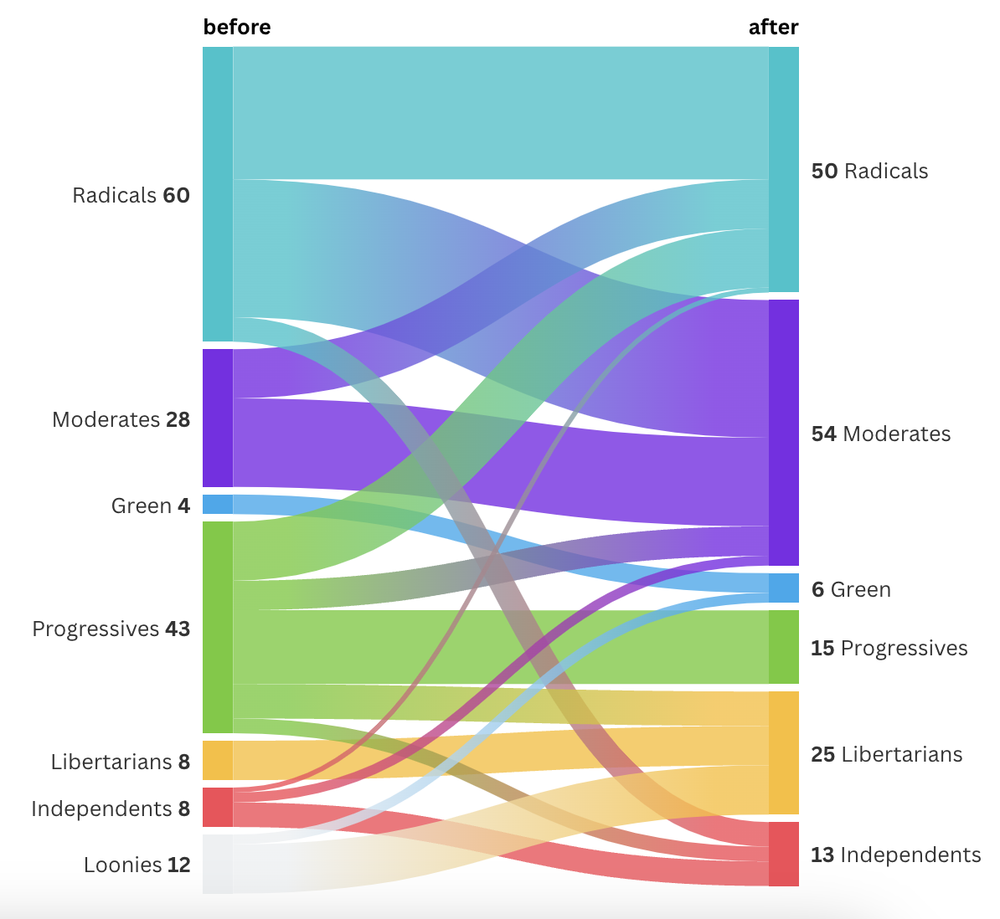

## `flourishcharts`: Flourish in R & Python

|   |   |   |
| ------------- | ------------- | ------------- |
[]() | []()  |   []() |
|  | |

Interactive data visualization for data practitioners. `flourishcharts` allows users to visualize their data 
using Flourish charts that are grounded in data storytelling principles. Users can create racing bar & line
charts, as well as other interactive elements commonly found in d3.js graphics, easily in R and Python. 
The package relies on an enterprise API provided by Flourish.

### Python package installation

You can install to a specific virtual env by using `pipenv`:

```
pipenv install flourishcharts
```

or to your global Python installation with `pip`:

```
python3 -m pip install --upgrade flourishcharts
```

### R package installation
Install from CRAN via:

```
install.packages("flourishcharts")
```

Alternatively, install from GitHub:

```
remotes::install_github("canva-public/flourishcharts", subdir="R_package")
```

### Key info

Grab a Flourish API key from [https://app.flourish.studio/settings](https://app.flourish.studio/settings). Store in one of two places, depending on language used:

* Python: in the `~/.envrc` file for the Python environment or, alternatively, your `~/.zshrc` or `~/.bashrc` file.

```
export FLOURISH_API_KEY="..."
```

* R: In your `~/.Renviron` file:

```
FLOURISH_API_KEY = "..."
```

### Any issues?

Please log an issue in the GitHub repository.
